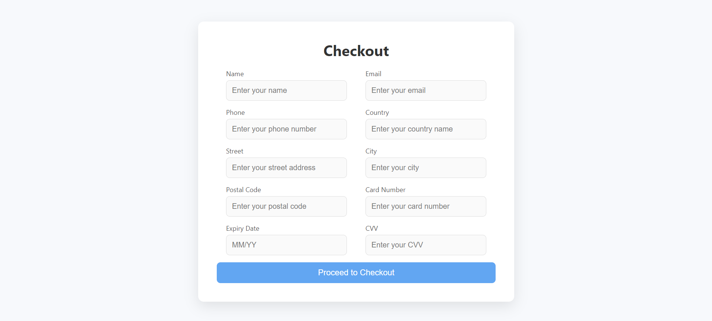
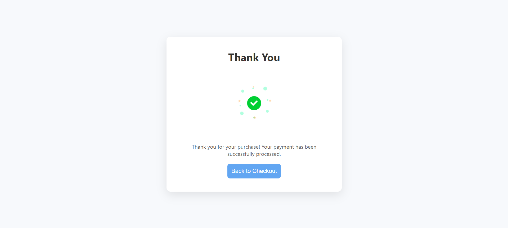
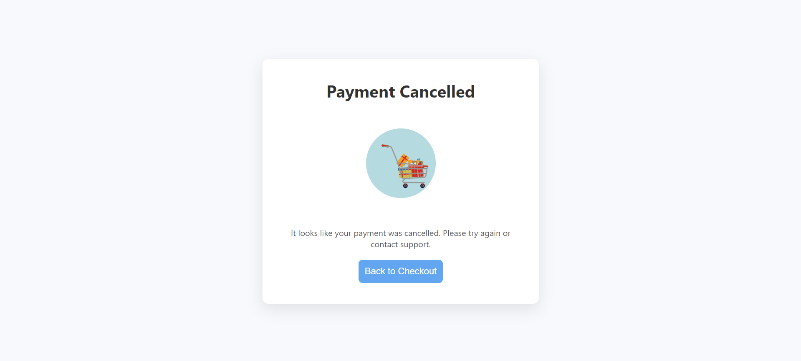

# MERN Checkout Payment System

- [MERN Checkout Payment System](#mern-checkout-payment-system)
  - [Features](#features)
  - [Tech Stack](#tech-stack)
  - [Project Structure](#project-structure)
  - [Getting Started](#getting-started)
    - [Prerequisites](#prerequisites)
    - [Installation](#installation)
    - [Running in Development Mode](#running-in-development-mode)
    - [Running in Production Mode](#running-in-production-mode)
  - [API Endpoints](#api-endpoints)
  - [Payment CRUD Functions](#payment-crud-functions)
  - [Models](#models)
  - [Payment Workflow](#payment-workflow)
  - [Screenshots](#screenshots)
    - [Checkout Page](#checkout-page)
    - [Payment Success Page](#payment-success-page)
    - [Payment Cancel Page](#payment-cancel-page)
  - [Deployment](#deployment)
  - [Contact](#contact)

This is a full-stack MERN (MongoDB, Express, React, Node.js) application that implements a checkout system with secure payment methods such as PayPal. It also includes user-friendly features like form validation, route protection, and loader components. The backend handles payment data storage using MongoDB with transaction support for reliable data consistency.

## Features

- **User Checkout**: Collects user information (name, email, phone, shipping address).
- **Payment Integration**: Supports payment processing through PayPal and other payment gateways.
- **Route Protection**: Prevents unauthorized access to certain pages like success and cancel without valid payment status.
- **Transaction Support**: Uses MongoDB transactions to ensure data consistency during CRUD operations.
- **Form Validation**: Validates user input fields such as email, phone number, and card details (expiry date, CVV).
- **User Experience**: Includes a loading spinner during payment processing and animations for success/cancel pages.

## Tech Stack

- **Frontend**: React.js
- **Backend**: Node.js, Express.js
- **Database**: MongoDB (Mongoose ORM)
- **Payment Gateway**: PayPal Sandbox
- **Animations**: Lottie (for success and cancel payment animations)

## Project Structure

```bash
|-- client/                    # React frontend
|   |-- public/                 # Public assets
|   |-- src/                    # React source code
|       |-- components/         # Reusable components (Checkout, Success, Cancel, etc.)
|       |-- pages/              # Application pages
|       |-- App.js              # Main App component
|-- server/                     # Express server
|   |-- models/                 # Mongoose models
|   |-- routes/                 # API routes
|   |-- controllers/            # Business logic for payment
|   |-- app.js               # Entry point for the Node server
|-- .env                        # Environment variables (API keys, DB connection)
|-- README.md                   # Documentation
```

## Getting Started

Follow these instructions to run the project locally on your machine.

### Prerequisites

Ensure you have the following installed:

- [Node.js](https://nodejs.org/)
- [MongoDB](https://www.mongodb.com/)
- [PayPal Developer Account](https://developer.paypal.com/)

### Installation

1. **Clone the repository**:

```bash
git clone git@github.com:akhtarnasim1990/paymentgateway.git
cd paymentgateway
```

2. **Install dependencies**:

```bash
# Backend (Express)
cd server
npm install

# Frontend (React)
cd ../client
npm install
```

3. **Set up environment variables**:

Create a `.env` file in the `server/` directory and add the following:

```bash
# .env
PAYPAL_MODE=sandbox
PAYPAL_CLIENT_ID=your-paypal-client-id
PAYPAL_SECRET=your-paypal-secret
```

4. **Start the backend**:

```bash
# From the server directory
cd server
npm start
```

5. **Start the frontend**:

```bash
# From the client directory
cd client
npm start
```

### Running in Development Mode

1. Start the MongoDB server if not already running:

```bash
mongod
```

2. In separate terminals, run the following for both frontend and backend:

```bash
# Backend API (Express.js)
cd server
npm start

# Frontend React App
cd client
npm start
```

### Running in Production Mode

1. Build the React frontend:

```bash
cd client
npm run build
```

2. Serve the production build:

```bash
cd server
npm install -g serve
serve -s build
```

## API Endpoints

- **`POST /api/v1/payment/create`**: Initiates payment using PayPal.
- **`POST /api/v1/payment/execute`**: Success/Cancel handler for completed payments.

## Payment CRUD Functions

- **createPayment**: Creates a new payment record in the database.
- **getPayment**: Retrieves a payment record by its payment ID from the database.
- **updatePayment**: Updates an existing payment record with new data.
- **deletePayment**: Deletes a payment record from the database by payment ID.

## Models

The `Payment` model is defined with the following fields:

- `payment_id`: User's payment id (String, required, unique)
- `state`: Payment state (String, required)
- `token`: Payment's token (String, required, unique)
- `name`: User's full name (String, required)
- `email`: User's email (String, required, validated)
- `phone`: User's phone number (String, required, validated)
- `country`: Shipping country (String, required)
- `street`: Shipping street (String, required)
- `city`: Shipping city (String, required)
- `postalCode`: Postal/ZIP code (String, required, validated)
- `cardNumber`: Card number (String, required, validated)
- `expiryDate`: Card expiry date in `MM/YY` format (String, required)
- `cvv`: Card CVV (String, required)

## Payment Workflow

1. **Checkout Form**: User enters name, email, phone, shipping details, and payment information.
2. **PayPal Integration**: After form submission, PayPal payment is initiated, and the user is redirected to the PayPal sandbox.
3. **Payment Success/Cancel**: Based on the result, the user is redirected to the `/success` or `/cancel` pages.
4. **Route Protection**: Direct access to `/success` or `/cancel` without a valid PayPal transaction is restricted.

## Screenshots

### Checkout Page



### Payment Success Page



### Payment Cancel Page



## Deployment

To deploy the app to a production environment:

1. Ensure that you have a production-ready MongoDB server (like MongoDB Atlas).
2. Set up your environment variables on the production server.
3. Build the React frontend using `npm run build`.
4. Deploy both the frontend and backend on a platform like [Heroku](https://www.heroku.com/), [Vercel](https://vercel.com/), or [DigitalOcean](https://www.digitalocean.com/).

---

## Contact

For any queries, feel free to contact me at `akhtar.nasim1990@gmail.com`.
